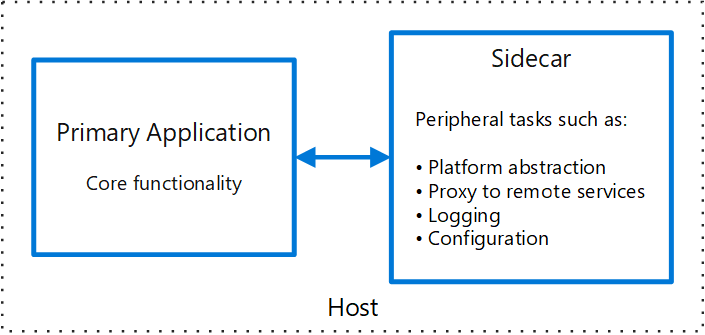

It is a pattern where part of application is deployed in a separate process or container to provide isolation and encapsulation.

For each instance of an application, a sidecar instance is hosted and deployed against it. 

### Advantages

- Sidecar can be built using different language or framework
- Sidecar can access and monitor the main application resources.
- No Communication Latency

#### Link

[https://learn.microsoft.com/en-us/azure/architecture/patterns/sidecar](https://learn.microsoft.com/en-us/azure/architecture/patterns/sidecar)
